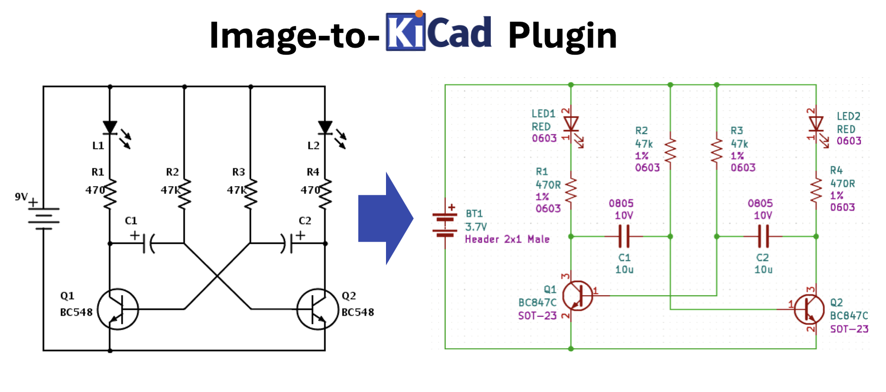
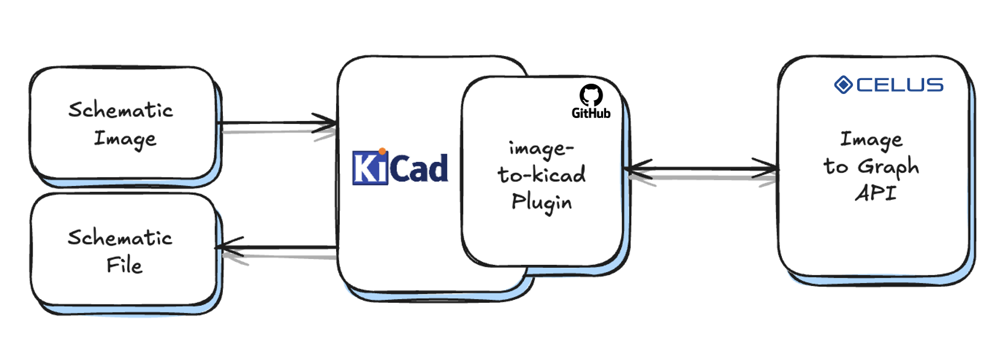
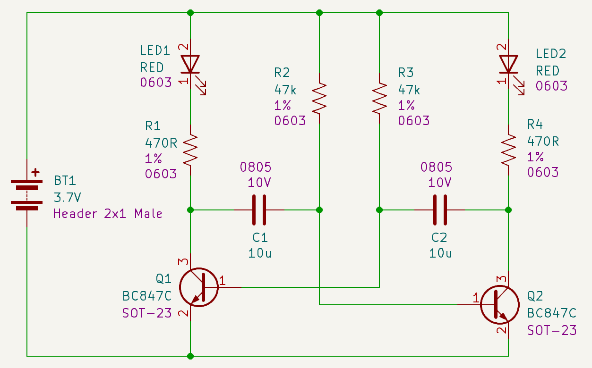

# Image-to-KiCad Plugin

A KiCad Plugin to convert schematic images into schematic files in KiCad native format.

Very often, component datasheets and reference designs contain drawings of application circuits that can be used for a variety of projects with minor adjustments. More often than not, engineers find themselves re-drawing such schematics on a CAD tool in order to use it.

The idea of this KiCad Plugin is to directly convert these images into native KiCad schematics, based on the libraries you have, in two separate steps:

- Use the CELUS image-to-graph API to convert the schematic image into a graph representation of the circuit

- Convert the graph representation to KiCad schematics using local KiCad libraries and configurations

## Converting Schematic Images to KiCad

TBD

## How it works

The conversion system is composed of two parts: a KiCad plugin and the image-to-graph API, provided by CELUS.

Once the user is authenticated, the KiCad Plugin is ready to be used. 

The image containing the schematic to be transformed can be added to a design, and a special action for image objects can be used to trigger the conversion.

Then, different machine learning models are applied to:

- Identify schematic symbols in the image with positioning and category;
- Extract text and infer text categories using OCR;
- Detect connections between components through line segments;
- Create relationships between the identified information objects;
- Generate a graph containing the extracted information;

The API returns the graph in JSON format back to the plugin, following a specific data model.

The image-to-kicad plugin can then generate the KiCad schematic by:

- Mapping node categories to schematic symbols, according to user configuration;
- Placing the symbols according to the node positions;
- Connecting symbol pins according to graph connections.

The result is a KiCad schematic that replicates the structure present on the image, generated in a few minutes.

## Installing the Plugin on KiCad

The image-to-kicad can be installed by using the Package and Content Manager menu available on KiCad.

## Configuring the Plugin

TBD

## Links

- [Roadmap](https://)
- [Discussion group](https://)
- [Bugs](https://)
- [KiCad Website](https://kicad.org)
- [CELUS Website](https://celus.io)
